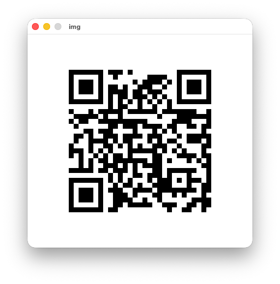

# QR Code Generator

A Python application that generates a QR code from a user-supplied URL and displays
it in a window. Built for the Advanced Artificial Intelligence hands-on assignment.



## Requirements

- Python 3.8 or later
- Dependencies listed in `requirements.txt`

## Installation

```bash
git clone https://github.com/tgsimonson/qr-code-generator.git
cd qr-code-generator
python -m venv .venv
source .venv/bin/activate        # Windows: .venv\Scripts\activate
pip install -r requirements.txt
```

## Usage

Pass the URL as an argument:

```bash
python qr_generator.py https://www.bioxsystems.com/
```

Or run without arguments and enter the URL when prompted:

```bash
python qr_generator.py
```

The generated code is written to `qrcode.png` in the working directory and displayed
in a window titled `img`. Close the window with its close button or by pressing
Escape; either exits the program cleanly. `qrcode.png` is regenerated on every run
and is not tracked in version control. Two fixed copies are committed for reference:
`docs/example-output.png` (the raw encoded image) and `docs/app-window.png` (the
application window, shown above).

## Design Notes

- URLs are validated with `urllib.parse` before encoding. Input must use the
  `http` or `https` scheme and include a network location.
- Error correction is set to level M, which tolerates roughly 15 percent damage
  to the printed code while remaining scannable.
- `version=1` with `fit=True` lets the library select the smallest QR version
  that fits the payload rather than forcing a fixed size.
- The library returns a 1-bit image, which some viewers and document renderers
  handle poorly, so the result is converted to RGB before saving.
- The `PhotoImage` reference is bound to the label widget to prevent Python's
  garbage collector from discarding the image before it renders.

## Verification

The generated code was decoded with OpenCV's `QRCodeDetector` and returned the
original input URL, confirming the output is machine-readable rather than only
visually plausible. Input validation was tested against a valid `https` URL, a
valid `http` URL, a bare domain with no scheme, and a non-URL string; the first
two were accepted and the last two rejected.
